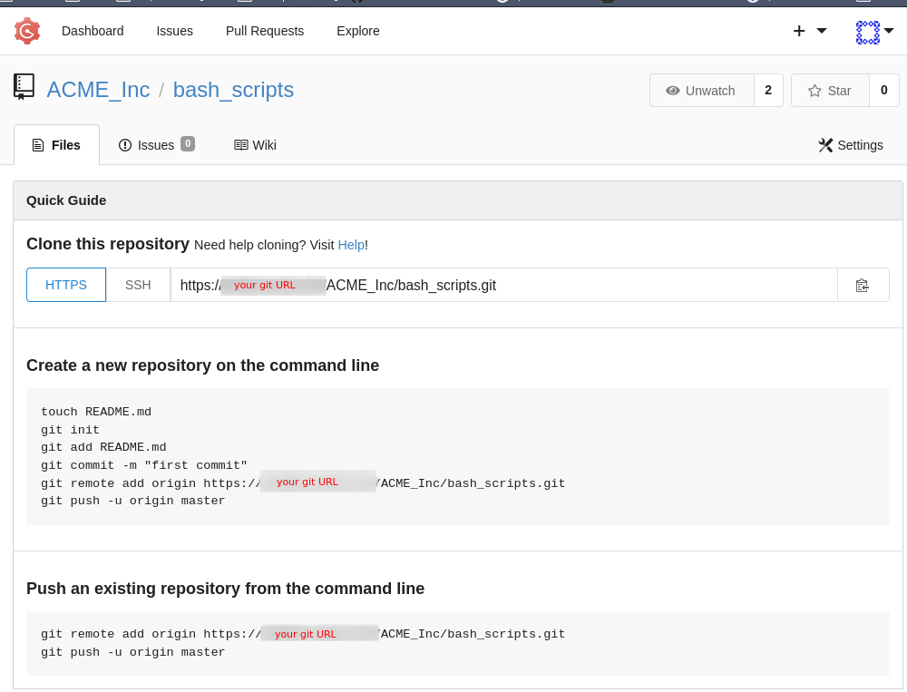

# Git Foundation Workshop

## Introduction

This workshop is aimed at **any IT professional** that have no or limited knowledge in Git and want to ramp up on **basic tasks**.

When it comes to system administration, a sysadmin doesn't have to know 100% of Git to perform system administration related tasks.

Actually, Git can be very helpful in **many cases** by just knowing 10% of Git.

This workshop will cover three different approaches to managing content in Git:

- single branch workflow
- multiple branch workflow
- forking workflow

We will see the advantages and disadvantages of each workflow through simple use cases.

We will focus on command line usage and terminal text editor. Many graphical text editor integrates Git (Atom, VSCode, etc.). People feeling comfortable using visual editors, feel free to use your tool of choice.

**IMPORTANT: Red Hat cannot recommend a particular Git workflow for your context.**

Every IT professional must evaluate the best way to maintain content in Git.

The following workshop aims at providing basic guidance for those who are in the process of implementing Git in their organizations.

This workshop is primarily designed and written in a way to be delivered by a Red Hat Consulting Services facilitator, to system engineers.

It is somehow entirely possible for an individual to follow this workshop at home without an instructor, and performs the steps on a public Github instance, for example.

It is also possible to replace the script used in the workshop by any type of content you like (documentation, PHP code, etc.).

## Assumptions

We assume that your organization has a central Git repository available.

**IMPORTANT**: it is possible to work with Git locally without a central repository, but it is not the focus of this workshop.

Different products exist:

- Github
- Gitlab
- Bitbucket
- Gogs
- Gitea
- ...

All those are code collaboration and version control tools offering repository management, with Git (the command line tool) at the core of most.

Those products not only offer code centralization, but often have features like collaboration issues tracking, kanban, authentication, authorization, automated tests, etc.

They can either be self-hosted or used as PaaS solutions.

The present document will show screenshots of a Gogs instance, but the workshop will ideally be delivered on the customer's Git tool.

For the purpose of demonstration and to make our examples as simple as possible, we also assume that no configuration management is currently in place in your organization.

## I'm not a developer. Why should I use Git?

Let's take Paul at ACME Inc.

He has a very useful bash script that he copied to all 100 different Linux servers on ACME estate.

Every block is a server and the green color represents **version 1** of the script:


Paul refactors the script and wants to upgrade all 100 servers with the new **version 2**.

For some reason, while copying the script, he forgets to copy to server #38.

Now we have two versions of the script across the estate.

**Version 2** is represented by the blue color, and we see server #38 still has **version 1**:


When we run the script on the estate, 99 servers are producing the expected output, and 1 server now behaves differently (#38).

Later on, Amber runs the script on server #52, find it very useful and realizes that she can further improve it.

She brings changes to the script on the Linux server #52 without talking to Paul. Let's call this isolated new script **version 3**.

We now have 3 different versions of the script! Amber's version is symbolized by the red color.


Meanwhile Paul has implemented a new feature to his copy of the script and decides to copy **version 2.1** to all servers.

This time he doesn't forget any server in the inventory.

**Version 2.1** (symbolized by the purple color) is now on all servers:


What happened?

- all servers now have **version 2.1**: Paul is happy
- server #38 situation is corrected: Paul is happy
- **version 3** on server #52 has been overwritten by **version 2.1**: Amber is unhappy

What can we conclude?

- we don't know exactly what version of the script is on what server
    - configuration management to copy the script to all servers can be an option
- a useful feature has been lost
  - collaborating on the script with Git allows to improve the script as a team

A combination of configuration management + git = success!

Let's focus on Git in this workshop!

## Setting up your command line environment

We need an environment with Git installed (this can be your laptop or a Linux server accessed over SSH).

Refer to your operating system / Linux distribution documentation to learn how to install Git.

```bash
$ git --version
git version 2.25.1
```

While not absolutely necessary, you can setup basic information about your identity with the following:

```bash
$ git config --global user.name "FIRST_NAME LAST_NAME"
$ git config --global user.email "FIRST_NAME.LAST_NAME@example.org"
```

## Setting up your Git UI environment

This is an example of default repository in a [Gogs](https://github.com/gogs) ("painless self hosted Git") instance:



The administrator of the Git instance should grant write access to the repository.

## The script
As an administrator you deal with bash scripts every day. You develop bash scripts, you share them with your colleagues either to enhance or to run on different servers.

For the sake of simplicity we're going to take a very basic script as our starting point, called `install-helloworld.sh`:

```bash
#!/bin/bash

VERSION=1

LOCATION=/tmp
DESTINATION=${LOCATION}/HelloWorld

cd ${LOCATION}
wget --quiet https://raw.githubusercontent.com/redhat-benelux/git-foundation-workshop-binaries/master/v${VERSION}

mv ${LOCATION}/v${VERSION} ${DESTINATION}

chmod 755 ${DESTINATION}

exit 0
```

The installer script (referred to as "script" from now on) downloads a Go application from Github, and installs it under `/tmp`.

The downloaded application (referred to as "app" from now on), when executed, displays a simple "hello world" message.

```bash
$ /tmp/HelloWorld
hello world v1
```

Let's store the script in Git!

[Next Chapter](02-master-workflow.md)
