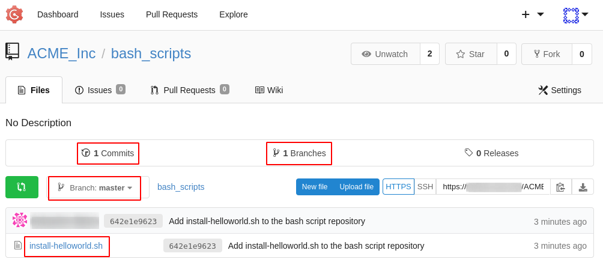
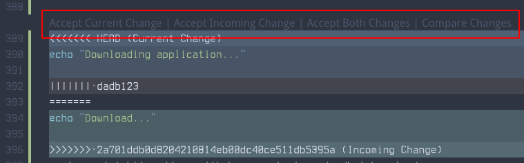
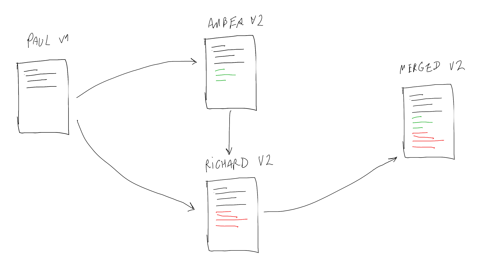

# Single Branch Workflow

This is the simplest way of storing content in Git. Let's have a look.

### Single user scenario


Paul needs to clone the repository on his work environment from Gogs with `git clone`:

```bash
paul $ git clone https://git.example.org/ACME_Inc/bash_scripts.git
Cloning into 'bash_scripts'...
warning: You appear to have cloned an empty repository.
```

Our repository (located in the `bash_scripts/` folder) is currently completely empty. The directory is not. We will look into this later.

Let's copy the script in the repository:

```bash
paul $ cp install-helloworld.sh bash_scripts/
```

We move to the `bash_scripts` directory and run `git status`:

```bash
paul $ cd bash_scripts/
paul $ git status
On branch master

No commits yet

Untracked files:
  (use "git add <file>..." to include in what will be committed)
	install-helloworld.sh

nothing added to commit but untracked files present (use "git add" to track)
```

Git tells us that the script is currently **untracked**.

We need to track it by using `git add`:

```bash
paul $ git add install-helloworld.sh
```

If we run `git status` again, we see that a change of type "new file" is **ready to be committed**:

```bash
paul $ git status
On branch master
Your branch is up to date with 'origin/master'.

Changes to be committed:
  (use "git restore --staged <file>..." to unstage)
	new file:   install-helloworld.sh
```

This shows us we are apparently sitting in the `master` branch.

**What is a branch in very simple words?**

Let's take a paper document with some content, say, a quote for a customer, this is our `master` copy. This is the document the sales department will want to eventually deliver to our customer.

The quote still needs some numbers from the engineering department.

Now we make a photocopy of the document and pass the copy to engineering. We will call this copy the `develop` document.

Engineering writes down some numbers and info and pass it back to the sales department.

The sales department now needs to merge (as in `git merge`) info and numbers from the `develop` version into the `master` copy.


**Branching** means you diverge from the main line of the document and continue to do work without modifying with the original document.

**Merging** is the operation of integrating a change from a branch into another branch.

Now that we have a basic understanding of what a branch is, let's **commit** our change with `git commit`:

```bash
paul $ git commit -m "Add install-helloworld.sh to the bash script repository"
[master (root-commit) 642e1e9] Add install-helloworld.sh to the bash script repository
 1 file changed, 14 insertions(+)
 create mode 100755 install-helloworld.sh
```

The `-m` option allows us to specify our commit message at the command line. Please write something meaningful! If you do not provide a message with `-m`, a text editor will appear asking to provide a commit message.

If we run `git status` again we see that our copy of the repository is ahead of Gogs (our `origin`), by 1 commit:

```bash
paul $ git status
On branch master
Your branch is ahead of 'origin/master' by 1 commit.
  (use "git push" to publish your local commits)

nothing to commit, working tree clean
```

We need to push our commit to Gogs (what we will call our `origin`), onto the `master` branch.

Before pushing our commit, let's explain **what a remote is.**

A remote is a remote copy of the Git repository. Earlier, we did a `git clone` of this remote repository, remember? All changes have been done to the local repository. In the directory `bash_scripts`, there is a directory called `.git`, which contains all the information needed to maintain the local repository. Do not remove it, without that directory, the repository isn't a repository anymore, instead it's just a directory.

By using `git remote`, we see the reference to the address of Gogs.

The `origin` name is an alias to that address.

```bash
Paul > git remote -v
origin	https://git.example.org/ACME_Inc/bash_scripts.git (fetch)
origin	https://git.example.org/ACME_Inc/bash_scripts.git (push)
```

We will use the `origin` alias as reference for pushing our changes.

Let's push our change to Gogs!

```bash
paul $ git push origin master
Enumerating objects: 3, done.
Counting objects: 100% (3/3), done.
Delta compression using up to 4 threads
Compressing objects: 100% (2/2), done.
Writing objects: 100% (3/3), 444 bytes | 222.00 KiB/s, done.
Total 3 (delta 0), reused 0 (delta 0)

To https://git.example.org/ACME_Inc/bash_scripts.git
 * [new branch]      master -> master
```

What happened? Let's refresh our Gogs web page:



A few important information already:

- a copy of our script is now stored in Gogs
- in the `master` branch, the only branch at this point
- there is 1 commit

So let's recap:

- we create new content in the local repo (a new file)
- we start tracking the new content (`git add`)
- we commit the new content (`git commit`)
- we push the new content to the remote repo, Gogs (`git push`)

Where do we stand?


### Small team scenario

In the single repository / single branch context, let's now assume the scenario of a small team (Paul, Amber, Richard) working together on the script.

Paul's script is in our remote repository, Gogs.

Amber and Richard will clone the repository on their work environment.

Tools like Gogs, [Github](https://github.com/redhat-benelux/) or [Gitlab](https://gitlab.com/) always present the address of the repository that should be used to clone it locally.

Most tools give the option to clone over HTTPS or SSH.

Depending on the setup, a username and password combination, a token or SSH keys might be required to clone.

Let's assume our example doesn't require authentication for cloning:

```
amber $ git clone https://git.example.org/ACME_Inc/bash_scripts.git
```

Now Paul, Amber and Richard all have the same copy of the script on their work environment.

Amber wants to improve the script.

She brings changes to the script and she will have to `add`, `commit` and `push`.

She brings changes:

```bash
amber $ cd bash_scripts
amber $ vim install-helloworld.sh
```

At this point, `git diff` allows her to see changes:

```bash
amber $ git diff install-helloworld.sh
diff --git a/install-helloworld.sh b/install-helloworld.sh
index 2d8172e..1035a06 100755
--- a/install-helloworld.sh
+++ b/install-helloworld.sh
@@ -5,6 +5,8 @@ VERSION=1
 LOCATION=/tmp
 DESTINATION=${LOCATION}/HelloWorld

+echo "Downloading application..."
+
 wget --quiet https://raw.githubusercontent.com/redhat-benelux/git-foundation-workshop-binaries/master/v${VERSION}

 mv ${LOCATION}/v${VERSION} ${DESTINATION}
```

Then she does the usual `add`, `commit`, `push`:

```bash
amber $ git add install-helloworld.sh
amber $ git commit -m "Print a message announcing the download"
amber $ git push origin master
```

Around the same time as Amber, Richard cloned the repository and wants to implement his own change to the script.

Amber doesn't tell Richard that she has pushed a change, so Richard believes he has the latest copy.

```
richard $ cd bash_scripts
richard $ vim install-helloworld.sh
richard $ git add install-helloworld.sh
richard $ git commit -m "Print a message announcing the download"
richard $ git push origin master
```

What happens?

```
richard > git push origin master
To https://git.example.org/ACME_Inc/bash_scripts.git
 ! [rejected]        master -> master (fetch first)
error: failed to push some refs to 'https://git.example.org/ACME_Inc/bash_scripts.git'
hint: Updates were rejected because the remote contains work that you do
hint: not have locally. This is usually caused by another repository pushing
hint: to the same ref. You may want to first integrate the remote changes
hint: (e.g., 'git pull ...') before pushing again.
hint: See the 'Note about fast-forwards' in 'git push --help' for details.
```

Git is hinting us that some updates have been brought since Richard's `git clone`.

We try to follow the recommendation of using `git pull` in the provided hint:

```
richard > git pull
remote: Enumerating objects: 5, done.
remote: Counting objects: 100% (5/5), done.
remote: Compressing objects: 100% (2/2), done.
remote: Total 3 (delta 1), reused 0 (delta 0)
Unpacking objects: 100% (3/3), 307 bytes | 307.00 KiB/s, done.
From https://git.example.org/ACME_Inc/bash_scripts
   dadb123..2a701dd  master     -> origin/master
Auto-merging install-helloworld.sh
CONFLICT (content): Merge conflict in install-helloworld.sh
Automatic merge failed; fix conflicts and then commit the result.
```

**Where do we stand? Let's make a timeline of events.**


We're facing a merge conflict that we will have to resolve manually.

Let's have a look at the script on Richard work environment:

```bash
#!/bin/bash

VERSION=1

LOCATION=/tmp
DESTINATION=${LOCATION}/HelloWorld

<<<<<<< HEAD
echo "Downloading application..."

||||||| dadb123
=======
echo "Download..."

>>>>>>> 2a701ddb0d8204210814eb00dc40ce511db5395a
wget --quiet https://raw.githubusercontent.com/redhat-benelux/git-foundation-workshop-binaries/master/v${VERSION}

echo "Install..."

mv ${LOCATION}/v${VERSION} ${DESTINATION}

chmod 755 ${DESTINATION}

exit 0
```

The following bits have been added by Git:

```bash
<<<<<<< HEAD
||||||| dadb123
=======
>>>>>>> 2a701ddb0d8204210814eb00dc40ce511db5395a
```

It visually presents changes made by Amber, and changes made by Richard.

The team should now decide what stays and what should go away.

Richard must use his text editor of choice to resolve the issue.

Some visual editors allow to fix issues visually.



When the situation is fixed, Richard can `push` the fixed script.

Let's see what happened to the original document:



What can we conclude?

- one person working on one repository and one branch can be fine
- as soon as more people need to contribute to the same content, a single branch in Git can be a problem which can quickly lead to
  - content conflicts
  - regressions
  - time wasted
- resolving a merge conflict can be tedious operation and should be avoided as much as possible
- a single repository and a single `master` branch quickly shows its limits when working as a team

Git branching can help avoiding such problems.

Let's see how we can take advantage of Git branches!

[Next Chapter](03-branching-workflow.md)
