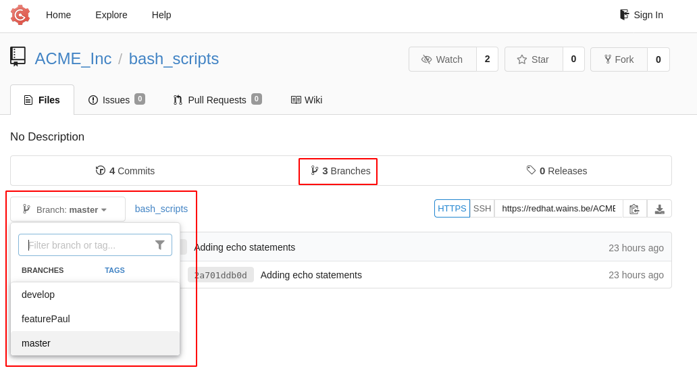
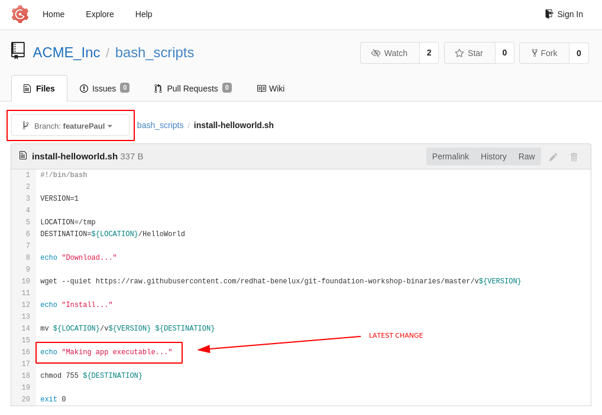
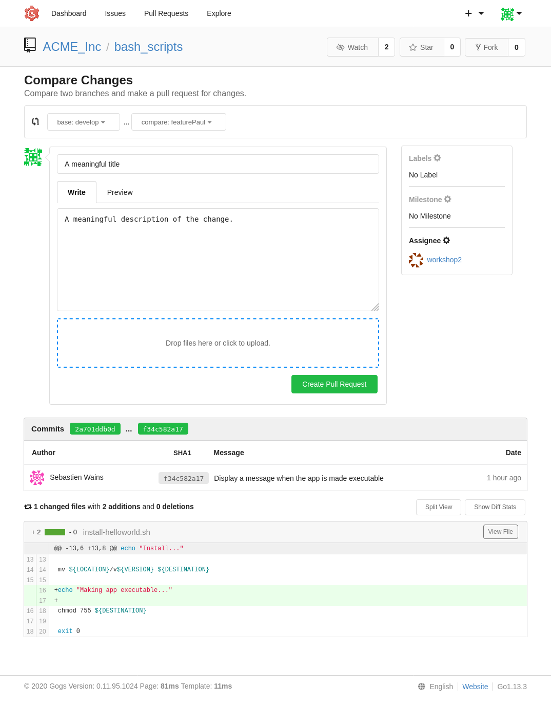
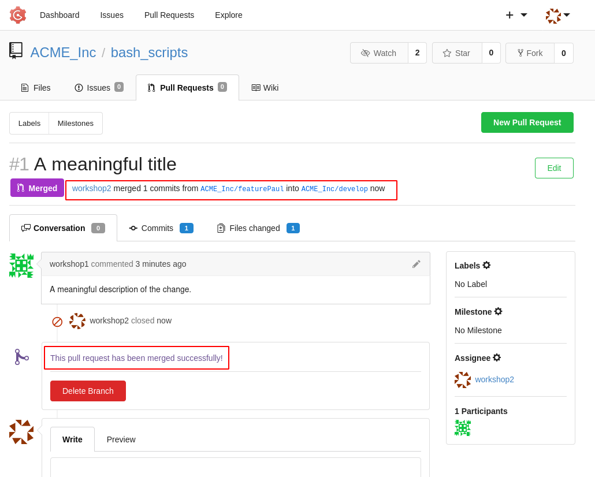
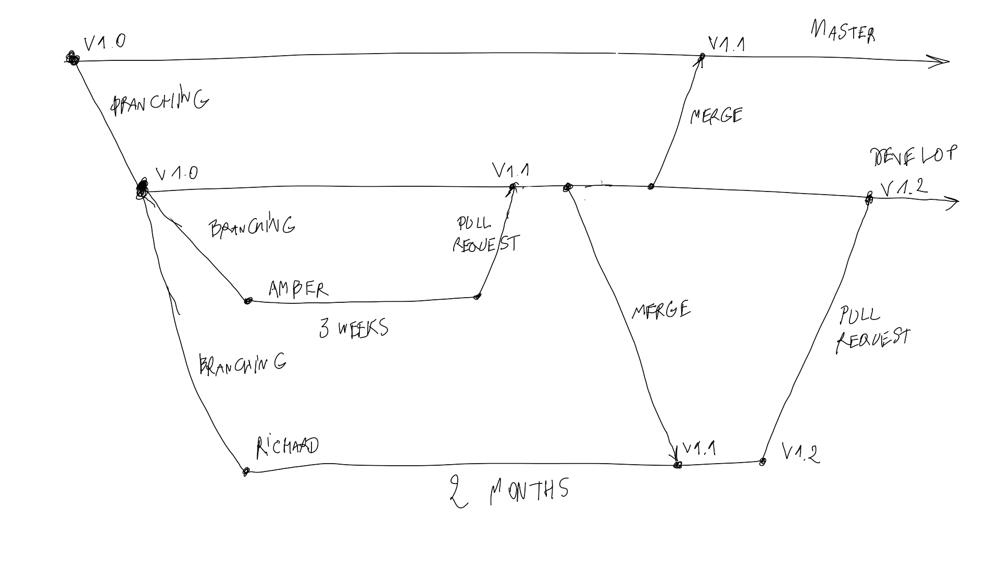

# Branching Workflow

So we've seen using a single branch and having everyone contributing to the same script quickly leads to problems.

Let's see how, as a team, we can work smarter, with **branching**.

In order to insure some quality assurance to our scripts repository, we're actually going to have a total of **3 branches**.

- `master`: our golden copy
- `develop`: the copy that will get new changes, branched from `master`
- `featurePaul`: Paul's copy, branched from `develop`

The `develop` branch is created and used as the place where all features, like the `featurePaul` mentioned here, are merged into `develop` before the combination is moved into `master`.

Let's visualize the idea:


// MtH: this image could use an arrow to add a direction to it? //

How do we create those branches?

```bash
Paul > git clone https://git.example.org/ACME_Inc/bash_scripts.git
Cloning into 'bash_scripts'...
remote: Enumerating objects: 10, done.
remote: Counting objects: 100% (10/10), done.
remote: Compressing objects: 100% (7/7), done.
remote: Total 10 (delta 1), reused 0 (delta 0)
Unpacking objects: 100% (10/10), 1.08 KiB | 276.00 KiB/s, done.
Paul > cd bash_scripts/

Paul > git branch -a
* master
  remotes/origin/HEAD -> origin/master
  remotes/origin/master

Paul > git checkout -b develop
Switched to a new branch 'develop'
Paul > git branch -a
* develop
  master
  remotes/origin/HEAD -> origin/master
  remotes/origin/master

Paul > git checkout -b featurePaul
Switched to a new branch 'featurePaul'
Paul > git branch -a
  develop
* featurePaul
  master
  remotes/origin/HEAD -> origin/master
  remotes/origin/master
```
Those branches are created on our **LOCAL** repository.

We assume Paul is the maintainer of the bash script repository and has permission to push new branches to the `remote` repository.

```
Paul > git checkout featurePaul
Paul > git push origin featurePaul
Total 0 (delta 0), reused 0 (delta 0)
To https://git.example.org/ACME_Inc/bash_scripts.git
 * [new branch]      featurePaul -> featurePaul
```

This has created a new branch to the remote repository.

`git branch` now tells us that the origin has the `featurePaul` branch.

```bash
Paul > git branch -a
  develop
* featurePaul
  master
  remotes/origin/HEAD -> origin/master
  remotes/origin/featurePaul
  remotes/origin/master
```

The remote still doesn't have the `develop` branch. Let's take care of it.

```bash
Paul > git checkout develop
Switched to branch 'develop'

Paul > git push origin develop
Total 0 (delta 0), reused 0 (delta 0)
To https://git.example.org/ACME_Inc/bash_scripts.git
 * [new branch]      develop -> develop

Paul > git branch -a
* develop
  featurePaul
  master
  remotes/origin/HEAD -> origin/master
  remotes/origin/develop
  remotes/origin/featurePaul
  remotes/origin/master
```

If we refresh Gogs, what do we see?



Paul wants to improve the script. He should now do so in his `featurePaul` branch:

```
Paul > git checkout featurePaul
Switched to branch 'featurePaul'
```
```
Paul > vim install-helloworld.sh
```
```
Paul > git --no-pager diff
diff --git a/install-helloworld.sh b/install-helloworld.sh
index f02729e..3a07230 100755
--- a/install-helloworld.sh
+++ b/install-helloworld.sh
@@ -13,6 +13,8 @@ echo "Install..."

 mv ${LOCATION}/v${VERSION} ${DESTINATION}

+echo "Making app executable..."
+
 chmod 755 ${DESTINATION}

 exit 0
```
```
Paul > git add .
```
```
Paul > git commit -m "Display a message when the app is made executable"
[featurePaul f34c582] Display a message when the app is made executable
 1 file changed, 2 insertions(+)
```
```
Paul > git push origin featurePaul
Enumerating objects: 5, done.
Counting objects: 100% (5/5), done.
Delta compression using up to 4 threads
Compressing objects: 100% (2/2), done.
Writing objects: 100% (3/3), 347 bytes | 173.00 KiB/s, done.
Total 3 (delta 1), reused 0 (delta 0)
To https://git.example.org/ACME_Inc/bash_scripts.git
   2a701dd..f34c582  featurePaul -> featurePaul
```

Let's have a look at Gogs from the perspective of the `master` branch and `featurePaul` branch:




A good practice is to make a merge request in Gogs for a colleague.

Why? Because now we have two people aware of the change, and four eyes see more then two.



By working this way, we reduce the [bus factor](https://en.wikipedia.org/wiki/Bus_factor).

If the merge request gets accepted, the change will land in the `develop` branch.



If everyone `git pull` the `develop` branch, we indeed see something has changed.

```bash
Richard > git checkout develop
Already on 'develop'
Your branch is up to date with 'origin/develop'.
```
```
Richard > git pull

remote: Enumerating objects: 1, done.
remote: Counting objects: 100% (1/1), done.
remote: Total 1 (delta 0), reused 0 (delta 0)
Unpacking objects: 100% (1/1), 255 bytes | 255.00 KiB/s, done.
From https://git.example.org/ACME_Inc/bash_scripts
   2a701dd..5b1b0c4  develop    -> origin/develop
Updating 2a701dd..5b1b0c4
Fast-forward
 install-helloworld.sh | 2 ++
 1 file changed, 2 insertions(+)
```

The `++` symbolize the number of lines that have changed.

Richard now has the latest copy of `develop` and can branch from there.

```
Richard > git checkout -b featureRichard
Switched to a new branch 'featureRichard'
```

Let's now assume that his feature takes 2 months to develop.

During those 2 months, the `develop` branch integrated a new feature from Amber.

Richard's feature branch has to keep track of Amber's change.

There are two ways to keep track of changes from our source branch: **merge** or **rebase**.

In this foundation workshop, we will cover the merging technique.



Richard is currently working in his own branch:

```
Richard > git branch
  develop
* featureRichard
  master
```

He needs to switch to his local `develop` branch:

```
Richard > git checkout develop
Switched to branch 'develop'
```
And pull changes that happened in the `develop` branch of the origin:

```
Richard > git pull origin develop
remote: Enumerating objects: 5, done.
remote: Counting objects: 100% (5/5), done.
remote: Compressing objects: 100% (2/2), done.
remote: Total 3 (delta 1), reused 0 (delta 0)
Unpacking objects: 100% (3/3), 282 bytes | 282.00 KiB/s, done.
From https://git.example.org/ACME_Inc/bash_scripts
   5b1b0c4..dc0766d  develop    -> origin/develop
Updating 5b1b0c4..dc0766d
Fast-forward
 install-helloworld.sh | 2 ++
 1 file changed, 2 insertions(+)
```

Now he switches back to his feature branch:

```
Richard > git checkout featureRichard
Switched to branch 'featureRichard'
```

And merge the local develop branch into his feature branch:

```
Richard > git merge develop featureRichard
Auto-merging install-helloworld.sh
Merge made by the 'recursive' strategy.
 install-helloworld.sh | 2 ++
 1 file changed, 2 insertions(+)
```

The merge was a success.

It is entirely possible to get a merge conflict at this point, **but** the conflict happens on his `feature` branch, not the `develop`, or worse the `master` branch. **The impact would be limited to his own feature branch.**

What can we conclude:

- working with feature branches prevent messing up the `master` or `develop` copy of the code
- using the merge request feature of Gogs visually helps us
  - merge request, when closed are "archived" and can always be consulted
  - it is possible to protect branches in Gogs and only give the possible for some maintainers to accept MR
- when developing a new feature, we should keep track of changes happening upstream (the `develop` branch we derived our `feature` branch from)

[Next Chapter](04-forking-workflow.md)
