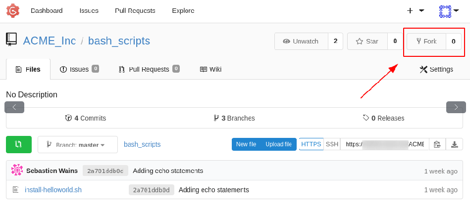
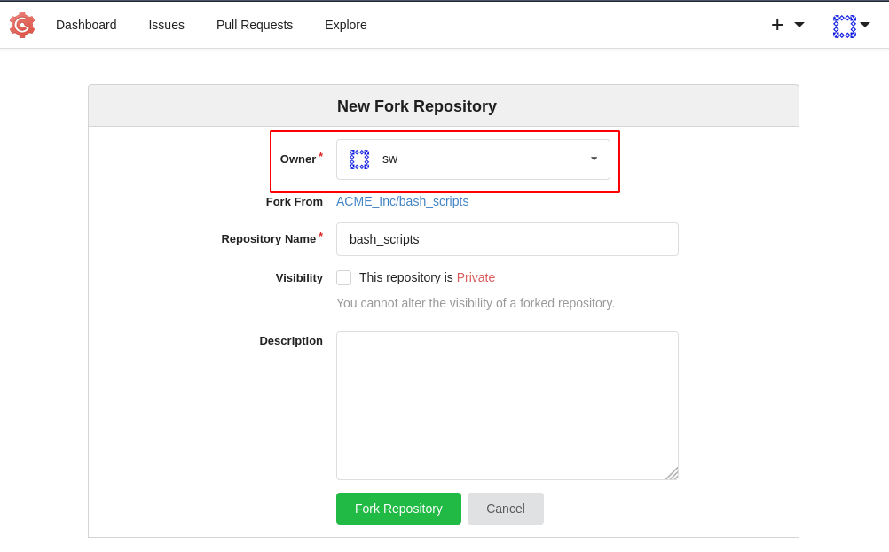
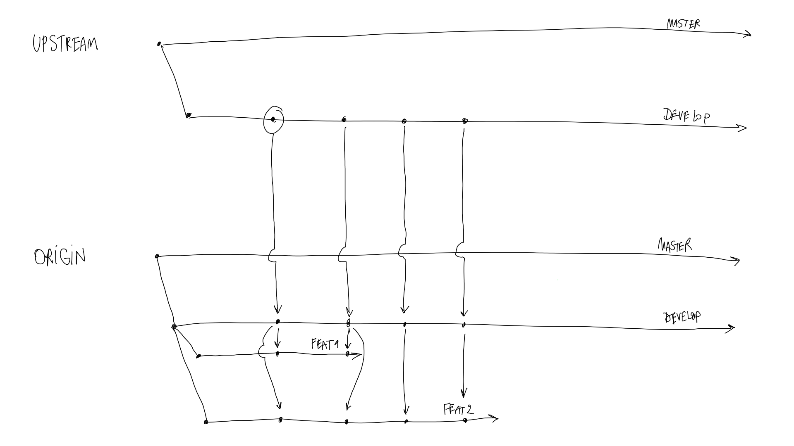

# Forking Workflow

The idea of forking is to retrieve a copy of the original repository in your own (Gitlab, Gogs, other) workspace.

The original repository can be referred to as **upstream**. The origin your fork derives from.

Your own copy can be referred as your **origin**.

In the branching model, the **origin** was the remote/original Git repository. The remote Git repository must now be considered the **upstream**. Your starting point for new branches will be your fork, **your origin**.


**Why or when should I use forks?**

Let's assume the Ansible project at [https://github.com/ansible/ansible](https://github.com/ansible/ansible).

The project has close to 5000 contributors.

It would simply be impossible to give the permission to 5000 contributors to create their own branch in the "official" Git repository.

Also, there would be a risk of push to some branches that could go without verification. For this some branches can be protected.

In Git based project were quality of code is imperative, it is advised to:

- designate project maintainers
- protect some branches from direct pushes
- enforce forking and merge requests

**How to create a fork**

It depends on the tool used, but usually there is a prominent button for the function:





We see that we are forking the repository in the workspace of user "sw".

If we `git clone` our own fork and run `git remote -v`, what happens?

```
> git clone https://git.example.org/my-username/bash_scripts.git
Cloning into 'bash_scripts'...
remote: Enumerating objects: 17, done.
remote: Counting objects: 100% (17/17), done.
remote: Compressing objects: 100% (12/12), done.
remote: Total 17 (delta 3), reused 0 (delta 0)
Unpacking objects: 100% (17/17), 1.83 KiB | 144.00 KiB/s, done.
```

```
> git remote -v
origin	https://git.example.org/my-username/bash_scripts.git (fetch)
origin	https://git.example.org/my-username/bash_scripts.git (push)
```

We see the remote points to your username workspace.

It means that whenever we interact with the `origin`, we are not messing up the original repo located at https://git.example.org/ACME_Inc/bash_scripts.git.

From this point on, we can apply the branching we have learned in the previous chapter (create a new feature branch from the develop branch of your fork).

**How to keep track of changes happening in the upstream?**

The question could also be "how to stay in sync with upstream".

Tools like BitBucket have functionality taking care of that for you.

We will see how we can keep things in sync from the command line, on the fork we have just cloned.

```
> git remote add upstream https://git.example.org/ACME_Inc/bash_scripts.git
> git remote -v
origin	https://git.example.org/my-username/bash_scripts.git (fetch)
origin	https://git.example.org/my-username/bash_scripts.git (push)
upstream	https://git.example.org/ACME_Inc/bash_scripts.git (fetch)
upstream	https://git.example.org/ACME_Inc/bash_scripts.git (push)
```

We now have **TWO** remotes. You can add several remotes to one git repository.

```
> git fetch upstream
From https://git.example.org/ACME_Inc/bash_scripts
 * [new branch]      develop     -> upstream/develop
 * [new branch]      master      -> upstream/master
```

You are fetching the content of the upstream with `git fetch`. It **doesn't** affect your code.

We can confirm this by listing the branches:

```
> git branch -a
* master
  remotes/origin/HEAD -> origin/master
  remotes/origin/develop
  remotes/origin/master
  remotes/upstream/develop
  remotes/upstream/master
```

We have just retrieved two "new" branches:

```
  remotes/upstream/develop
  remotes/upstream/master
```

Let's assume that the `develop` branch of the remote `upstream` has new changes. Let's merge those changes in your own `develop` branch:

```
> git fetch upstream
> git checkout --track origin/develop
> git merge upstream/develop develop
```

We see that a small change has been done:

```bash
Updating dc0766d..039d027
Fast-forward
 install-helloworld.sh | 2 ++
 1 file changed, 2 insertions(+)
```

From this point on, we can start a new feature from the freshly updated develop:

```
git checkout -b my_new_feature
```

It is advised to keep track of changes happening upstream regularly.

You can even try to integrate changes from `upstream/develop` into your `origin/my_new_feature`:

```
git merge upstream/develop my_new_feature
```

It is somehow possible to run into merge conflicts if changes happening upstream are touching the code you're working on.

In order to reduce the risk of massive merge conflicts, it is advised to sync as often as needed:



In the scenario above, changes essential to feat1 and feat2 are merged from the upstream to the origin.

Advantages of forking:

- clear separation of workspaces
- not messing up with the upstream
- doesn't require write access to upstream
- changes are accepted through merge requests
- upstream stays clean
- develop can choose to keep merged branches as long as he wants

Disadvantages of forking:

- develop has to keep his fork in sync through management of several remotes
- maintainer could reject a merge request if it appears the developer didn't keep track of upstream changes

[Next Chapter](05-ansible-tower.md)
