# Using Git with Ansible Tower

Ansible Tower has been built with development best practices in mind.

This means that Tower can take advantage of things like forks and branches, in order to run playbooks and roles in a controlled way.

Let's take the example of an `upstream` repository containing an Ansible playbook, made of 3 branches:

- `master`
- `stage`
- `develop`

A developer has forked the upstream repository and he's adding a new feature branch to his `origin`:

- `feature`

Let's visualize the situation:

upstream/develop | upstream/stage | upstream/master
:-------------------------:|:-------------------------:|:----:
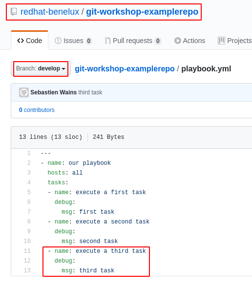  |  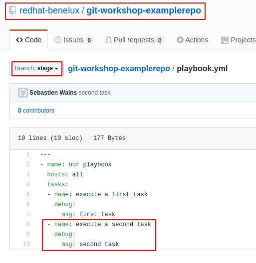|

origin/feature |
:---:|
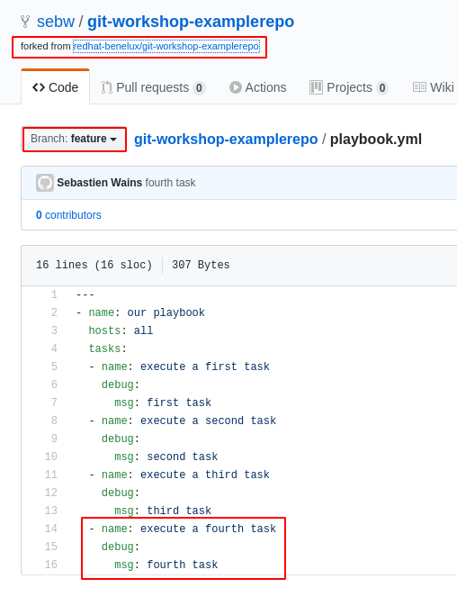 |

Let's configure Tower with those git repositories and branches in mind:

The upstream master branch can be configured like this:

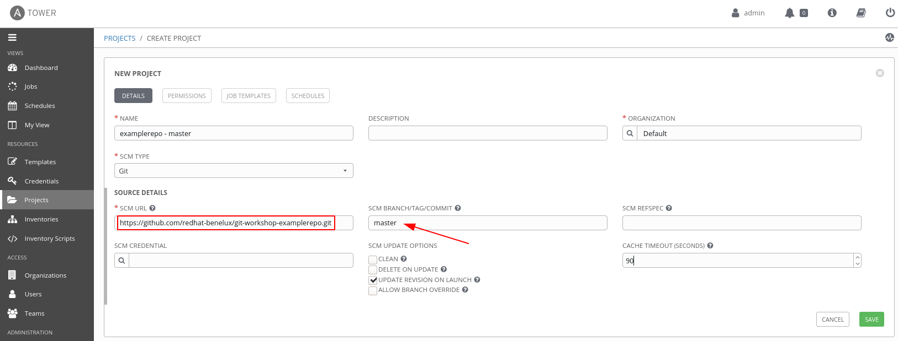

You would create three instances each pointing to the `master`, `stage`, `develop` branches.

You also create a project for the developer's fork:

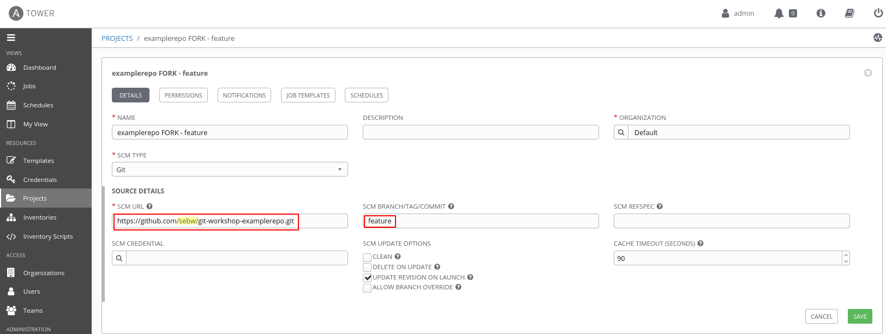

In total we have four new projects:

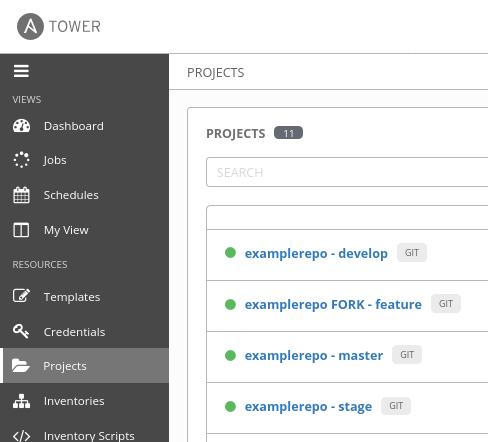

We assume we have four inventories:

- production: contains critical production systems
- acc: contains staging and preprod systems
- development: contains test and dev systems:
- lab: contains fresh machines that are dedicated to test and validate new Ansible code

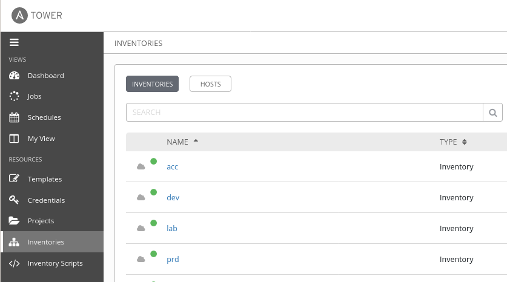

We are now going all the dots together, by configuring 4 templates:

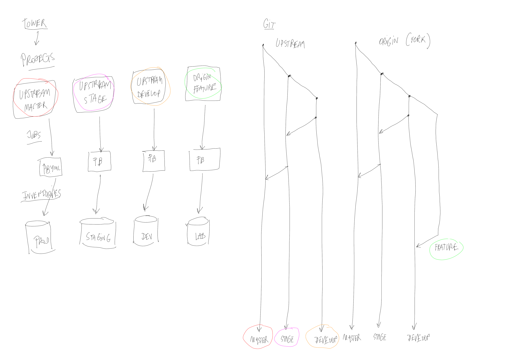

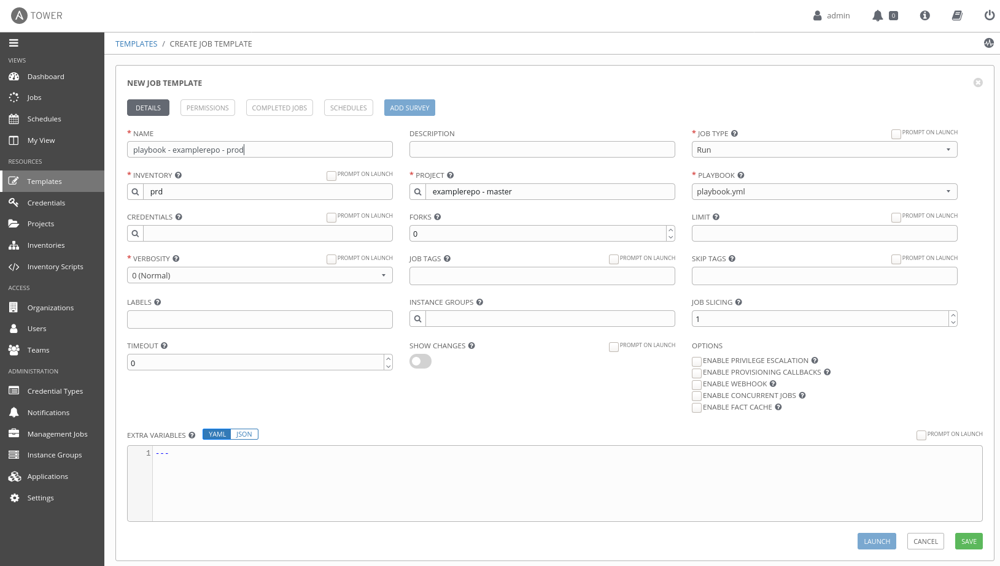

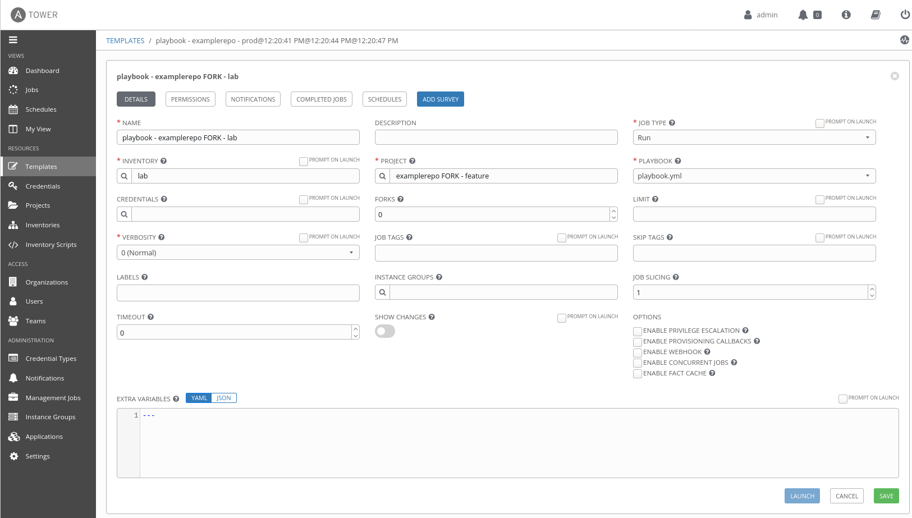

In total we now have 4 templates:

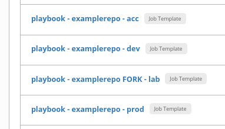

Recap:

 /  | production | stage| develop| feature
:----:|:-------------------------:|:-------------------------:|:----------------:|:---------------:
Playbook | playbook.yml | playbook.yml | playbook.yml | playbook.yml
Project | origin/master | origin/stage | origin/develop | fork/feature
Inventory | prd | acc | dev | lab

If we now run the 4 templates, we are running:

- v1 against production inventory, production systems will display only one task
- v2 against acc inventory, staging systems will display two tasks
- v3 against dev inventory, development and test systems will display three tasks
- v4 against lab inventory, the lab system will display the newest feature, the fourth task
